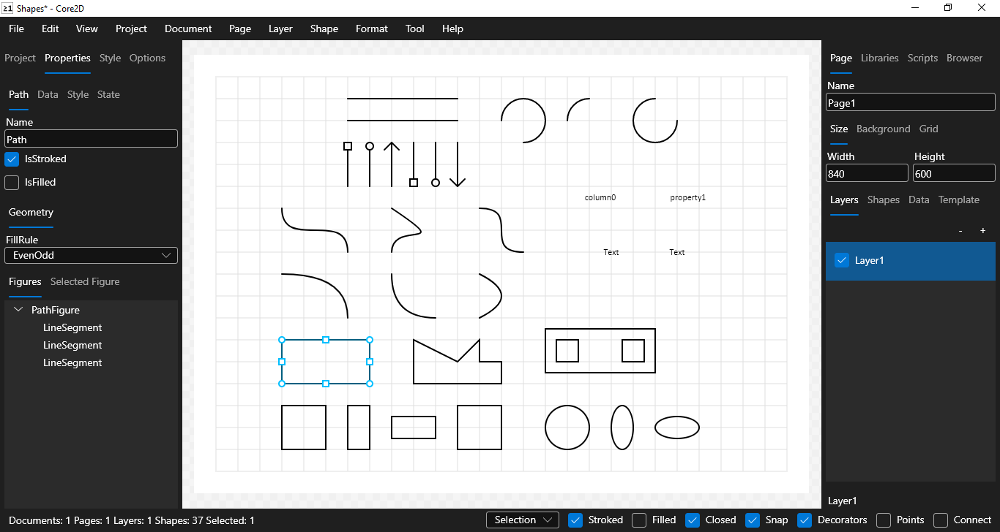

# Core2D

[](https://www.codefactor.io/repository/github/wieslawsoltes/core2d)
[](https://gitter.im/wieslawsoltes/Core2D?utm_source=badge&utm_medium=badge&utm_campaign=pr-badge)

[](https://dev.azure.com/wieslawsoltes/GitHub/_build/latest?definitionId=54)

[](https://github.com/wieslawsoltes/core2d)
[](https://github.com/wieslawsoltes/core2d)
[](https://github.com/wieslawsoltes/core2d)

[](https://builtwithdot.net/project/116/core2d)

A multi-platform data driven 2D diagram editor.

## About

Core2D is a multi-platform application for making data driven 2D diagrams. 
The application has built-in wyswig vector graphics editor where you can bind data to shapes, 
share data across multiple documents, edit documents using layers. 
It supports exporting documents to many popular file formats like pdf, bitmaps and dxf. 
You can automate drawing and processing by using C# scripting.

[](images/Core2D.png)

## Supported Platforms

* `Windows 7 SP1 or higher`
* `Linux`
* `macOS`

## Usage

```
Core2D.Desktop:
  A multi-platform data driven 2D diagram editor.

Usage:
  Core2D.Desktop [options]

Options:
  -t, --theme <DefaultDark|DefaultLight|FluentDark|FluentLight>    Set application theme
  -s, --scripts <scripts>                                          The relative or absolute path to the script files
  -p, --project <project>                                          The relative or absolute path to the project file
  --repl                                                           Run scripting repl
  --useManagedSystemDialogs                                        Use managed system dialogs
  --useSkia                                                        Use Skia renderer
  --enableMultiTouch                                               Enable multi-touch [default: True]
  --useGpu                                                         Use Gpu [default: True]
  --allowEglInitialization                                         Allow EGL initialization [default: True]
  --useWgl                                                         Use Windows GL
  --useDeferredRendering                                           Use deferred rendering [default: True]
  --useWindowsUIComposition                                        Use Windows UI composition [default: True]
  --useDirectX11                                                   Use DirectX11 platform api
  --useHeadless                                                    Use headless
  --useHeadlessDrawing                                             Use headless drawing
  --useHeadlessVnc                                                 Use headless vnc
  --createHeadlessScreenshots                                      Create headless screenshots
  --vncHost <vncHost>                                              Vnc host
  --vncPort <vncPort>                                              Vnc port [default: 5901]
  --version                                                        Show version information
  -?, -h, --help                                                   Show help and usage information
```

## Resources

* [GitHub source code repository.](https://github.com/wieslawsoltes/Core2D)
* [Wiki.](https://github.com/wieslawsoltes/Core2D/wiki)

## JetBrains Rider

Core2D is developed using JetBrains Rider.

[]( https://www.jetbrains.com/?from=Core2D)

## License

Core2D is licensed under the [MIT license](LICENSE.TXT).
