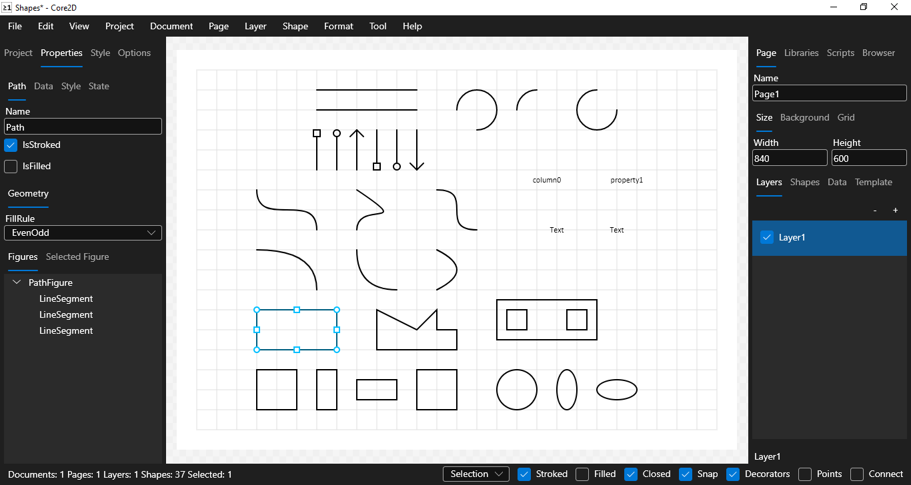

# Core2D

[](https://gitter.im/wieslawsoltes/Core2D?utm_source=badge&utm_medium=badge&utm_campaign=pr-badge)

[](https://dev.azure.com/wieslawsoltes/GitHub/_build/latest?definitionId=54)

[](https://www.nuget.org/packages/Core2D.Model)
[](https://www.myget.org/gallery/core2d-nightly) 

[](https://github.com/wieslawsoltes/core2d)
[](https://github.com/wieslawsoltes/core2d)
[](https://github.com/wieslawsoltes/core2d)

[](https://builtwithdot.net/project/116/core2d)

A multi-platform data driven 2D diagram editor.

## About

Core2D is a multi-platform application for making data driven 2D diagrams. 
The application has built-in wyswig vector graphics editor where you can bind data to shapes, 
share data across multiple documents, edit documents using layers. 
It also supports exporting documents to many popular file formats like pdf, bitmaps and dxf. 
You can automate drawing and processing by using C# scripting.

[](images/Core2D.png)

## Supported Platforms

* `Windows` using the `Core2D.UI.Wpf` or `Core2D.UI.Avalonia` project.
* `Linux` using `Core2D.UI.Avalonia` project.
* `macOS` using the `Core2D.UI.Wpf` project through LibreWPF, or the `Core2D.UI.Avalonia` project.
* `.NET Core` supported platforms using `Core2D.UI.Avalonia` project.

The core libraries are portable and should work on all platforms where C# is supported.

### LibreWPF on macOS

The restored WPF application targets `.NET 10` and `LibreWPF.Sdk` `0.1.0-preview.44`.
Its package source is the sibling LibreWPF checkout at
`../wpf/artifacts/packages/Release/NonShipping`, as configured in `NuGet.Config`.

Build and launch the application on macOS with:

```sh
./run-librewpf-macos.sh
```

Run the deterministic startup smoke check with:

```sh
CORE2D_LIBREWPF_SMOKE=1 ./run-librewpf-macos.sh
```

The legacy PDFsharp and Windows Enhanced Metafile paths are not registered in the
portable WPF application. PDF and bitmap export continue through the SkiaSharp writers.

## Resources

* [GitHub source code repository.](https://github.com/wieslawsoltes/Core2D)
* [Wiki.](https://github.com/wieslawsoltes/Core2D/wiki)

## NuGet

Core2D base libraries are delivered as a NuGet package.

You can find the packages here [NuGet](https://www.nuget.org/packages/Core2D.Base/) and install the package like this:

`Install-Package Core2D.Base`

or by using nightly build feed:
* Add `https://www.myget.org/F/core2d-nightly/api/v2` to your package sources
* Alternative nightly build feed `https://pkgs.dev.azure.com/wieslawsoltes/GitHub/_packaging/CI/nuget/v3/index.json`
* Update your package using `Core2D` feed

and install the package like this:

`Install-Package Core2D.Base -Pre`

## License

Core2D is licensed under the [MIT license](LICENSE.TXT).
